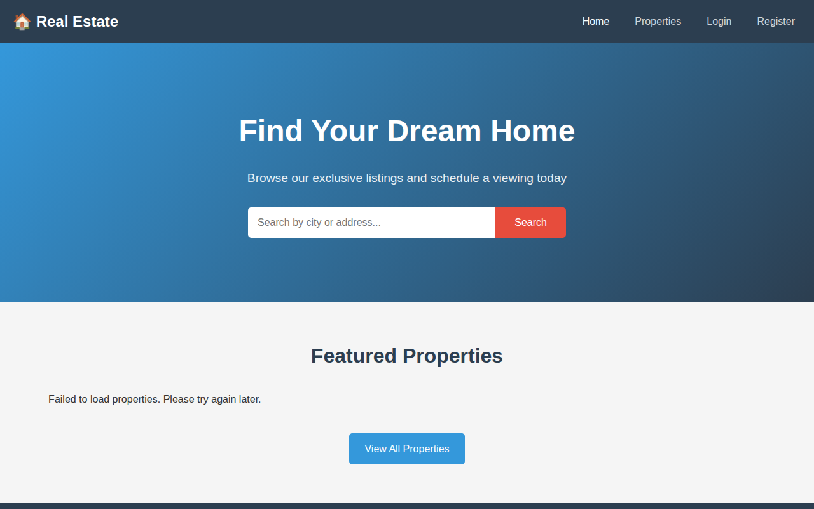
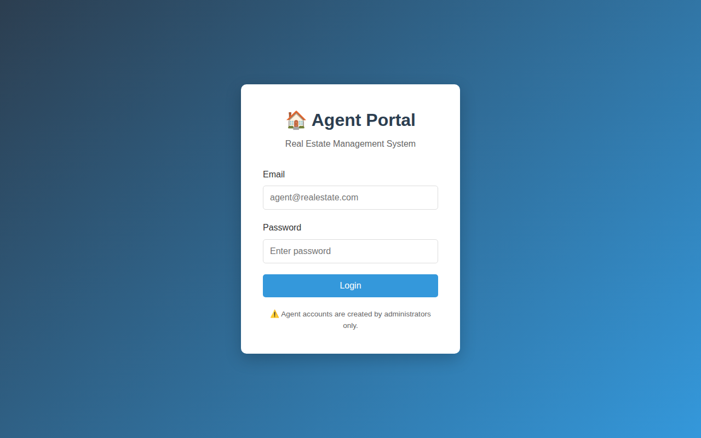
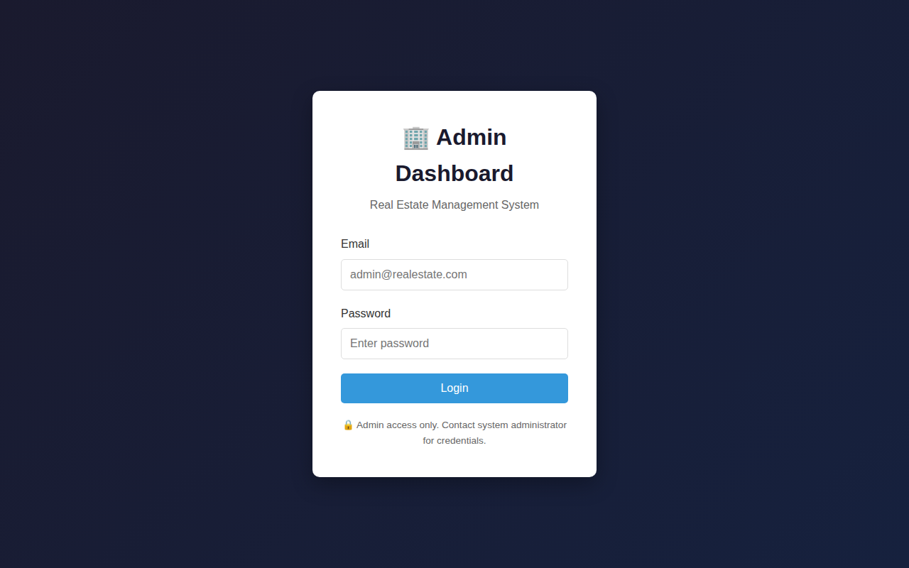

# Real Estate Fullstack Application

<div align="center">


**A complete fullstack real estate platform with separate portals for customers, agents, and administrators.**

[Features](#-features) • [Quick Start](#-quick-start) • [User Journeys](#-user-journeys) • [Architecture](#-architecture) • [Roadmap](#-roadmap)

</div>

---

## 🆕 What's New (v1.2.0)

### Platform Improvements & New Features

This release addresses critical, high, and medium priority improvements from system critique, introducing new security features and functionality.

#### Security Enhancements

| Feature | Description |
|---------|-------------|
| **Rate Limiting** | General API: 100 requests/15min, Auth endpoints: 5 attempts/15min |
| **Database Transactions** | Mark-sold/rented and queue promotion now use atomic transactions |
| **Password Reset** | Users can reset passwords via phone verification |

#### New API Endpoints

| Endpoint | Description |
|----------|-------------|
| **Messages API** | Two-way messaging between users (inbox, sent, send, reply) |
| **Favorites API** | Save/unsave properties, toggle, check status |
| **Analytics API** | Dashboard summary, sales trends, top agents, booking trends |
| **Password Reset** | `/api/auth/forgot-password` and `/api/auth/reset-password` |

#### Code Quality

| Improvement | Description |
|-------------|-------------|
| **Shared API Module** | All frontends now use `../shared/js/api.js` |
| **Integration Tests** | New test suite for v1.2.0 features |
| **Database Schema** | Added `messages` and `favorites` tables |

#### New Database Tables

```sql
-- Messages (two-way messaging)
messages (id, sender_id, recipient_id, parent_id, subject, body, is_read, created_at)

-- Favorites (saved properties)
favorites (id, customer_id, property_id, notes, created_at)
```

---

## 🆕 What's New (v1.1.0)

### Property Lifecycle Management

This release introduces complete property lifecycle management, enabling agents and admins to track properties from listing through sale/rental to archival.

#### Key Features

| Feature | Description | Portal |
|---------|-------------|--------|
| **Mark as Sold/Rented** | One-click status change with automatic appointment cancellation | Agent, Admin |
| **Sales Tracking** | Track who closed each sale for commission purposes | Agent, Admin |
| **My Sales Dashboard** | View your closed deals with stats (count, total value) | Agent |
| **Sales Report** | Filter by agent, date range with CSV export | Admin |
| **Archive System** | Archive sold/rented properties to clean up active listings | Agent, Admin |
| **SOLD/RENTED Badges** | Visual indicators on property cards for sold/rented status | Customer |
| **Unavailable Notice** | Clear messaging when properties are no longer available | Customer |

#### Screenshots

**Agent Portal - My Sales Tab:**


*View your closed deals with total count and value statistics.*

**Admin Portal - Sales Report:**


*Filter sales by agent and date range, export to CSV for commission calculations.*

**Customer Portal - Sold Property Badge:**


*Properties display SOLD/RENTED overlay badges when no longer available.*

#### Business Rules

| Scenario | Behavior |
|----------|----------|
| Admin adds property via SQL | No assigned agent (NULL) |
| Admin adds property via website | Can choose agent or leave empty |
| Agent adds property via website | Auto-assigned to themselves |
| Agent marks sold | `sold_by_agent_id` = agent's ID |
| Admin marks sold | Can specify which agent gets credit |
| Archive | Only sold/rented properties can be archived |
| Unarchive | Admin only |

---

## 📊 Production Readiness Assessment

### Overall Score: 85/100

| Category | Score | Status |
|----------|-------|--------|
| **Core Features** | 95% | ✅ Complete |
| **Security** | 85% | ✅ Good (rate limiting, bcrypt, RBAC) |
| **Database Design** | 95% | ✅ Excellent (proper indexes, constraints) |
| **API Design** | 90% | ✅ RESTful, documented |
| **Frontend Code** | 80% | ⚠️ Good (now uses shared modules) |
| **Testing** | 70% | ⚠️ Unit tests exist, needs E2E |
| **Documentation** | 95% | ✅ Comprehensive |
| **Deployment Ready** | 60% | ⚠️ Needs production config |

### What Makes This Production-Ready ✅

- **Microsecond-precision booking queue** - Handles concurrent bookings correctly
- **Complete property lifecycle** - Listing → Sale → Archive flow
- **Role-based access control** - Server-side enforcement
- **Privacy-preserving ratings** - Anonymized customer names
- **Database transactions** - Atomic multi-step operations
- **Rate limiting** - Protection against brute force
- **Two-way messaging** - Customer ↔ Agent communication
- **Comprehensive API** - 50+ endpoints documented

### What Needs Work Before Production ⚠️

| Gap | Impact | Effort to Fix |
|-----|--------|---------------|
| Console-based SMS | Can't verify real users | 1 day (Twilio integration) |
| No email notifications | Users miss updates | 1 day (SendGrid integration) |
| No map-based search | Limited property discovery | 2-3 days |
| No E2E tests | Risk of regressions | 2-3 days |
| HTTP only (no HTTPS) | Security risk | 1 hour (nginx/certbot) |
| No CI/CD pipeline | Manual deployments | 4 hours |

---

## 📋 Table of Contents

- [Production Readiness Assessment](#-production-readiness-assessment)
- [Known Limitations](#️-known-limitations)
- [Future Roadmap](#️-future-roadmap)
- [Technical Debt & Improvements](#-technical-debt--improvements)
- [Deployment Guide](#-deployment-guide)
- [What's New (v1.1.0)](#-whats-new-v110)
- [Overview](#overview)
- [Features](#-features)
- [System Architecture](#-system-architecture)
- [User Journeys](#-user-journeys)
- [Business Logic Deep Dive](#-business-logic-deep-dive)
- [Project Structure](#-project-structure)
- [Quick Start](#-quick-start)
- [Screenshots](#-screenshots)
- [API Reference](#-api-reference)
- [Database Schema](#-database-schema)
- [Fullstack vs Frontend-Only Comparison](#-fullstack-vs-frontend-only-comparison)
- [Troubleshooting](#-troubleshooting)
- [User Experience Critique](#-user-experience-critique)
- [Platform Critique](#-platform-critique)
- [Roadmap & TODO](#-roadmap--todo)
- [Security Notes](#-security-notes)
- [License](#-license)

---

## ⚠️ Known Limitations

### Demo-Only Features (Not Production-Ready)

| Feature | Current State | Production Requirement |
|---------|---------------|----------------------|
| **SMS Verification** | Prints to console | Integrate Twilio, Vonage, or AWS SNS |
| **Email Notifications** | Not implemented | Integrate SendGrid, Mailgun, or AWS SES |
| **File Storage** | Local filesystem | Use S3, GCS, or Azure Blob Storage |
| **Session Management** | Simple JWT | Add refresh tokens, token rotation |
| **Password Policy** | Min 6 characters | Add complexity requirements |

### Features Not Included

| Feature | Status | Notes |
|---------|--------|-------|
| **Map-Based Search** | ❌ Not implemented | Would need Google Maps or Mapbox integration |
| **Geolocation Search** | ❌ Not implemented | "Properties near me" functionality |
| **Virtual Tours** | ❌ Not implemented | 360° photo/video integration |
| **Mortgage Calculator** | ❌ Not implemented | Monthly payment estimator |
| **Document Management** | 🔶 Stub only | Contract uploads, ID verification |
| **Real-time Updates** | ❌ Not implemented | WebSocket for live notifications |
| **Mobile App** | ❌ Not implemented | React Native or Flutter app |
| **Multi-language** | ❌ Not implemented | i18n support |
| **Multi-currency** | ❌ Not implemented | Currency conversion |

### Technical Limitations

| Limitation | Impact | Mitigation |
|------------|--------|------------|
| Single database | No failover | Add MySQL replication |
| No caching | Higher DB load | Add Redis caching layer |
| No CDN | Slower image loads | Use CloudFront or Cloudflare |
| No search indexing | Limited text search | Add Elasticsearch |
| Synchronous operations | Blocking on heavy tasks | Add job queue (Bull/Redis) |

---

## 🛣️ Future Roadmap

### v1.3.0 - Communication & Notifications (Planned)

| Feature | Description | Priority |
|---------|-------------|----------|
| **Real SMS Integration** | Twilio/Vonage for phone verification | 🔴 High |
| **Email Notifications** | SendGrid for booking confirmations, updates | 🔴 High |
| **Appointment Reminders** | Automated reminders 24h before viewing | 🟡 Medium |
| **Push Notifications** | Browser push for real-time alerts | 🟡 Medium |

### v1.4.0 - Enhanced Search & Discovery (Planned)

| Feature | Description | Priority |
|---------|-------------|----------|
| **Map-Based Search** | Google Maps integration with property pins | 🔴 High |
| **Geolocation Search** | "Properties within X miles" | 🟡 Medium |
| **Saved Search Alerts** | Email when matching properties listed | 🟡 Medium |
| **Full-Text Search** | Search property descriptions | 🟢 Low |

### v1.5.0 - Advanced Features (Planned)

| Feature | Description | Priority |
|---------|-------------|----------|
| **Document Management** | Contract uploads, e-signatures | 🟡 Medium |
| **Virtual Tour Integration** | Matterport/YouTube 360 embeds | 🟡 Medium |
| **Mortgage Calculator** | Monthly payment estimator | 🟢 Low |
| **Comparison Tool** | Compare 2-3 properties side by side | 🟢 Low |

### v2.0.0 - Platform Expansion (Future)

| Feature | Description | Priority |
|---------|-------------|----------|
| **Mobile App** | React Native iOS/Android app | 🟡 Medium |
| **Multi-tenancy** | Support multiple real estate agencies | 🟢 Low |
| **API Marketplace** | Third-party integrations | 🟢 Low |
| **AI Property Matching** | ML-based recommendations | 🟢 Low |

---

## 🔧 Technical Debt & Improvements

### Code Quality

| Issue | Current State | Recommended Fix |
|-------|---------------|-----------------|
| **Frontend API files** | Deprecated copies exist | Remove `*/js/api.js` files, use only `shared/js/api.js` |
| **Error handling** | Inconsistent error messages | Standardize error response format |
| **Logging** | Console.log statements | Use structured logging (Winston/Pino) |
| **Config management** | .env files | Use environment-specific configs |

### Database

| Issue | Current State | Recommended Fix |
|-------|---------------|-----------------|
| **No migrations** | Manual SQL files | Add migration tool (Knex, Sequelize) |
| **No connection pooling config** | Default settings | Tune pool size for production |
| **No read replicas** | Single DB | Add read replica for reporting |

### Security

| Issue | Current State | Recommended Fix |
|-------|---------------|-----------------|
| **JWT secret** | In .env file | Use secrets manager (AWS Secrets, Vault) |
| **No HTTPS** | HTTP only | Add TLS termination (nginx + Let's Encrypt) |
| **No CORS restrictions** | Allow all origins | Restrict to known domains |
| **No input sanitization** | Basic validation | Add comprehensive sanitization |

### Testing

| Issue | Current State | Recommended Fix |
|-------|---------------|-----------------|
| **No E2E tests** | Unit tests only | Add Cypress or Playwright |
| **No API tests** | Manual testing | Add Supertest for API testing |
| **No load testing** | Unknown capacity | Add k6 or Artillery load tests |
| **No coverage reports** | Unknown coverage | Add NYC/Istanbul coverage |

---

## 🚀 Deployment Guide

### Prerequisites

| Requirement | Minimum | Recommended |
|-------------|---------|-------------|
| **Server** | 1 vCPU, 1GB RAM | 2 vCPU, 4GB RAM |
| **MySQL** | 5.7 | 8.0 |
| **Node.js** | 14.x | 18.x LTS |
| **Storage** | 10GB | 50GB (for images) |

### Option 1: Traditional VPS (DigitalOcean, Linode, AWS EC2)

```bash
# 1. Clone repository
git clone https://github.com/hanszelmur/real-estate-fullstack.git
cd real-estate-fullstack

# 2. Install dependencies
cd backend && npm install --production

# 3. Set up environment
cp .env.example .env
nano .env  # Configure production values

# 4. Set up MySQL
mysql -u root -p < backend/sql/schema.sql
mysql -u root -p < backend/sql/seed.sql  # Optional: demo data

# 5. Install PM2 for process management
npm install -g pm2
pm2 start server.js --name real-estate-api

# 6. Set up nginx reverse proxy
sudo apt install nginx
# Configure /etc/nginx/sites-available/real-estate

# 7. Set up SSL with Let's Encrypt
sudo apt install certbot python3-certbot-nginx
sudo certbot --nginx -d yourdomain.com
```

### Option 2: Docker Deployment

```dockerfile
# Dockerfile (create in backend/)
FROM node:18-alpine
WORKDIR /app
COPY package*.json ./
RUN npm install --production
COPY . .
EXPOSE 3000
CMD ["node", "server.js"]
```

```yaml
# docker-compose.yml
version: '3.8'
services:
  api:
    build: ./backend
    ports:
      - "3000:3000"
    environment:
      - DB_HOST=db
      - DB_USER=root
      - DB_PASSWORD=${DB_PASSWORD}
      - DB_NAME=real_estate_db
    depends_on:
      - db
  
  db:
    image: mysql:8.0
    environment:
      - MYSQL_ROOT_PASSWORD=${DB_PASSWORD}
      - MYSQL_DATABASE=real_estate_db
    volumes:
      - mysql_data:/var/lib/mysql
      - ./backend/sql:/docker-entrypoint-initdb.d

  nginx:
    image: nginx:alpine
    ports:
      - "80:80"
      - "443:443"
    volumes:
      - ./nginx.conf:/etc/nginx/nginx.conf
      - ./customer-frontend:/usr/share/nginx/html/customer
      - ./agent-frontend:/usr/share/nginx/html/agent
      - ./admin-frontend:/usr/share/nginx/html/admin

volumes:
  mysql_data:
```

### Option 3: Cloud Platform (Heroku, Railway, Render)

```bash
# Heroku example
heroku create real-estate-api
heroku addons:create jawsdb:kitefin  # MySQL
heroku config:set JWT_SECRET=your_secret
git push heroku main
```

### Production Environment Variables

| Variable | Description | Example |
|----------|-------------|---------|
| `NODE_ENV` | Environment mode | `production` |
| `DB_HOST` | Database host | `db.example.com` |
| `DB_USER` | Database user | `app_user` |
| `DB_PASSWORD` | Database password | `(use secrets manager)` |
| `DB_NAME` | Database name | `real_estate_prod` |
| `JWT_SECRET` | Token signing key | `(use secrets manager)` |
| `PORT` | API port | `3000` |
| `CORS_ORIGIN` | Allowed origins | `https://yourdomain.com` |

### Production Checklist

- [ ] Set `NODE_ENV=production`
- [ ] Use strong JWT secret (32+ characters)
- [ ] Configure CORS to restrict origins
- [ ] Set up HTTPS with valid SSL certificate
- [ ] Configure database connection pooling
- [ ] Set up log aggregation (CloudWatch, Datadog)
- [ ] Configure backup strategy for database
- [ ] Set up monitoring and alerting
- [ ] Configure rate limiting for production load
- [ ] Remove seed data / use production seed

---

## Overview

This is a **production-ready fullstack starter** for building real estate platforms. It demonstrates:

- **Multi-role authentication** with customer, agent, and admin portals
- **Second-level precision booking** with automatic queue management
- **Real-time notifications** and status updates
- **Agent rating system** with privacy-preserving reviews
- **Complete CRUD operations** for properties, users, and appointments

**Key differentiator:** Unlike frontend-only demos with mock data, this application features:
- ✅ Real MySQL persistence
- ✅ Multi-user concurrent access handling
- ✅ Backend event processing (queue promotion, notifications)
- ✅ True role-based access control enforced server-side

---

## ✨ Features

### 🏠 Property Management
| Feature | Description | Roles |
|---------|-------------|-------|
| **Full CRUD Operations** | Create, read, update, delete property listings | Admin, Agent |
| **Agent Assignment** | Properties assigned to specific agents for accountability | Admin |
| **Featured Properties** | Highlight premium listings on homepage | Admin |
| **Multi-status Tracking** | Available, Pending, Sold, Rented status management | Admin, Agent |
| **Property Types** | House, Apartment, Condo, Land, Commercial | All |
| **Listing Types** | For Sale, For Rent | All |
| **Rich Details** | Bedrooms, bathrooms, square feet, lot size, year built | All |
| **Image Upload** | Upload multiple images per property via multipart/form-data | Admin, Agent |
| **Image Gallery** | Display property images in a browsable gallery | All |
| **Legacy Image URLs** | Backward compatible support for external image URLs | Admin, Agent |
| **Mark as Sold/Rented** 🆕 | One-click property status change with appointment cancellation | Admin, Agent |
| **Sales Tracking** 🆕 | Track who sold each property for commission purposes | Admin, Agent |
| **Archive System** 🆕 | Archive sold/rented properties to clean up listings | Admin, Agent |

### 📅 Booking System (Second-Level Precision)
| Feature | Description |
|---------|-------------|
| **Microsecond Timestamps** | `DATETIME(6)` precision for exact booking order |
| **Double-Booking Prevention** | Server-side slot conflict detection |
| **Automatic Queuing** | When slot taken, customer added to queue |
| **Instant Promotion** | Cancelled booking → next customer auto-promoted |
| **High-Demand Warnings** | Frontend alerts about queue possibility |
| **Blocked Slots** | Agents can block times for unavailability |
| **Status Tracking** | Pending → Confirmed → Completed / Cancelled / Queued |

### ⭐ Agent Rating System
| Feature | Description |
|---------|-------------|
| **Post-Viewing Ratings** | 1-5 stars after completed appointments |
| **One Rating Per Appointment** | Prevents duplicate/spam ratings |
| **Self-Rating Prevention** | Server-enforced restriction |
| **Optional Feedback** | Text comments with ratings |
| **Privacy Protection** | Customer names anonymized (e.g., "J***") |
| **Rating Summary** | Average rating, total reviews, distribution breakdown |
| **Agent Notifications** | Agents notified of new ratings |

### 👥 User Management & Authentication
| Feature | Description |
|---------|-------------|
| **Role-Based Access Control** | Customer, Agent, Admin with enforced permissions |
| **Phone Verification** | 6-digit SMS code (console-based for demo) |
| **Secure Password Storage** | bcrypt hashing |
| **Token Authentication** | Session tokens for API access |
| **Account Activation** | Admin can enable/disable accounts |
| **Profile Management** | Users can view and update profiles |

### 🔔 Notification System
| Feature | Description |
|---------|-------------|
| **Appointment Notifications** | Booking confirmations, cancellations, promotions |
| **Rating Notifications** | Agents notified of new reviews |
| **System Notifications** | Account status changes |
| **Read/Unread Tracking** | Mark individual or all as read |

### 📋 Additional Features
| Feature | Description |
|---------|-------------|
| **Property Waitlist** | Customers can express interest |
| **Agent Assignments Tracking** | Historical assignment records |
| **Dashboard Statistics** | Admin overview of platform metrics |
| **Pagination** | All list endpoints support pagination |
| **Filtering** | Filter by status, type, price range, etc. |

---

## 🏗 System Architecture

```
┌─────────────────────────────────────────────────────────────────────┐
│                         FRONTEND LAYER                              │
├─────────────────┬─────────────────┬─────────────────────────────────┤
│  Customer Portal│   Agent Portal  │        Admin Portal             │
│  (port 3001)    │   (port 3002)   │        (port 3003)              │
│                 │                 │                                 │
│  • Browse props │  • Manage props │  • User management              │
│  • Book viewing │  • Appointments │  • Property oversight           │
│  • Rate agents  │  • View ratings │  • Agent assignments            │
│  • Waitlist     │  • Notifications│  • System statistics            │
└────────┬────────┴────────┬────────┴────────────────┬────────────────┘
         │                 │                         │
         │            REST API Calls                 │
         ▼                 ▼                         ▼
┌─────────────────────────────────────────────────────────────────────┐
│                     BACKEND API LAYER                               │
│                     (Express.js - port 3000)                        │
├─────────────────────────────────────────────────────────────────────┤
│  Authentication Middleware │ Role-Based Access Control              │
├─────────────────────────────────────────────────────────────────────┤
│  Routes:                                                            │
│  • /api/auth/*        - Registration, Login, Verification           │
│  • /api/properties/*  - Property CRUD                               │
│  • /api/appointments/*- Booking with queue management               │
│  • /api/ratings/*     - Agent rating system                         │
│  • /api/users/*       - User management (admin)                     │
│  • /api/notifications/*- Notification handling                      │
│  • /api/waitlist/*    - Property waitlist                           │
└────────────────────────────────┬────────────────────────────────────┘
                                 │
                           SQL Queries
                           (Parameterized)
                                 ▼
┌─────────────────────────────────────────────────────────────────────┐
│                     DATABASE LAYER                                  │
│                     (MySQL 5.7+)                                    │
├─────────────────────────────────────────────────────────────────────┤
│  Tables: users, properties, appointments, agent_ratings,            │
│          agent_assignments, blocked_slots, notifications,           │
│          verifications, waitlist                                    │
└─────────────────────────────────────────────────────────────────────┘
```

---

## 🚶 User Journeys

### Customer Journey

```
┌─────────────────────────────────────────────────────────────────────┐
│                      CUSTOMER JOURNEY                               │
└─────────────────────────────────────────────────────────────────────┘

1. REGISTRATION & VERIFICATION
   ┌─────────┐    ┌─────────────┐    ┌─────────────┐    ┌──────────┐
   │ Register│───>│ Receive SMS │───>│ Enter Code  │───>│ Verified │
   │  Form   │    │ Code (6-dig)│    │ in Modal    │    │  Account │
   └─────────┘    └─────────────┘    └─────────────┘    └──────────┘

2. PROPERTY DISCOVERY
   ┌──────────┐    ┌────────────┐    ┌───────────────┐
   │ Homepage │───>│ Browse All │───>│ View Property │
   │ Featured │    │ Properties │    │ Details + Agent│
   │ Listings │    │ with Filters│   │ Rating        │
   └──────────┘    └────────────┘    └───────────────┘

3. BOOKING A VIEWING
   ┌──────────────┐    ┌──────────────┐    ┌────────────────────┐
   │ Select Date  │───>│ See Warning  │───>│ Submit Request     │
   │ & Time Slot  │    │ (High Demand)│    │                    │
   └──────────────┘    └──────────────┘    └─────────┬──────────┘
                                                     │
                    ┌────────────────────────────────┴────────────┐
                    │                                             │
                    ▼                                             ▼
          ┌─────────────────┐                           ┌─────────────────┐
          │ SLOT AVAILABLE  │                           │  SLOT TAKEN     │
          │ Status: Pending │                           │ Status: Queued  │
          │                 │                           │ Position: #N    │
          └────────┬────────┘                           └────────┬────────┘
                   │                                             │
                   ▼                                             │
          ┌─────────────────┐                                    │
          │ Agent Confirms  │◄───────────────────────────────────┘
          │ Status: Confirmed                    (via promotion)
          └────────┬────────┘
                   │
                   ▼
          ┌─────────────────┐    ┌─────────────────┐
          │ Attend Viewing  │───>│ Agent Marks     │
          │                 │    │ Complete        │
          └─────────────────┘    └────────┬────────┘
                                          │
                                          ▼
                                 ┌─────────────────┐
                                 │ RATE AGENT      │
                                 │ 1-5 Stars +     │
                                 │ Feedback        │
                                 └─────────────────┘
```

### Agent Journey

```
┌─────────────────────────────────────────────────────────────────────┐
│                        AGENT JOURNEY                                │
└─────────────────────────────────────────────────────────────────────┘

1. LOGIN (Account created by Admin)
   ┌─────────────┐    ┌───────────────────┐
   │ Login with  │───>│ Agent Dashboard   │
   │ Credentials │    │ • Stats Overview  │
   │             │    │ • Rating Display  │
   └─────────────┘    │ • Notifications   │
                      └───────────────────┘

2. PROPERTY MANAGEMENT
   ┌───────────────┐    ┌────────────────┐    ┌────────────────┐
   │ View Assigned │───>│ Edit Property  │───>│ Add New        │
   │ Properties    │    │ Details        │    │ Property       │
   └───────────────┘    └────────────────┘    │ (Auto-assigned)│
                                              └────────────────┘

3. APPOINTMENT WORKFLOW
   ┌──────────────┐    ┌──────────────┐    ┌──────────────┐
   │ View Pending │───>│ Confirm      │───>│ Conduct      │
   │ Requests     │    │ Appointment  │    │ Viewing      │
   └──────────────┘    └──────────────┘    └──────┬───────┘
                                                  │
                    ┌─────────────────────────────┴───────────┐
                    ▼                                         ▼
          ┌─────────────────┐                       ┌─────────────────┐
          │ Mark Completed  │                       │ Cancel (if      │
          │ • Customer can  │                       │ needed)         │
          │   now rate      │                       │ • Queue promotes│
          └─────────────────┘                       └─────────────────┘

4. VIEW RATINGS & FEEDBACK
   ┌───────────────────────────────────────┐
   │ Dashboard shows:                      │
   │ • Average Rating (★ 4.5)              │
   │ • Total Reviews (12)                  │
   │ • Recent Feedback                     │
   └───────────────────────────────────────┘
```

### Admin Journey

```
┌─────────────────────────────────────────────────────────────────────┐
│                        ADMIN JOURNEY                                │
└─────────────────────────────────────────────────────────────────────┘

1. DASHBOARD OVERVIEW
   ┌─────────────────────────────────────────────────────────────────┐
   │ Statistics at a Glance:                                         │
   │ ┌───────────┐ ┌───────────┐ ┌───────────┐ ┌───────────┐       │
   │ │Total Users│ │Properties │ │Appointments│ │Active     │       │
   │ │    45     │ │    28     │ │    156    │ │Agents: 8  │       │
   │ └───────────┘ └───────────┘ └───────────┘ └───────────┘       │
   └─────────────────────────────────────────────────────────────────┘

2. USER MANAGEMENT
   ┌────────────────┐    ┌─────────────────┐    ┌─────────────────┐
   │ View All Users │───>│ Filter by Role  │───>│ Edit User       │
   │ (paginated)    │    │ (Customer/Agent)│    │ • Change Role   │
   └────────────────┘    └─────────────────┘    │ • Activate/     │
                                                │   Deactivate    │
                                                │ • Reset Password│
                                                └─────────────────┘

3. PROPERTY MANAGEMENT
   ┌────────────────┐    ┌─────────────────┐    ┌─────────────────┐
   │ All Properties │───>│ Add Property    │───>│ Assign Agent    │
   │ (any status)   │    │                 │    │                 │
   └────────────────┘    │ Edit Property   │    │ Mark Featured   │
                         │                 │    │                 │
                         │ Delete Property │    │ Change Status   │
                         └─────────────────┘    └─────────────────┘

4. APPOINTMENT OVERSIGHT
   ┌─────────────────────────────────────────────────────────────────┐
   │ View all appointments across all agents and customers           │
   │ • Filter by status (pending/confirmed/completed/cancelled)      │
   │ • See queued customers and their positions                      │
   │ • Edit appointment details                                      │
   │ • Hard delete appointments (admin-only)                         │
   └─────────────────────────────────────────────────────────────────┘
```

---

## 🔄 Business Logic Deep Dive

### Booking System: Second-Level Precision Queue Management

The booking system is designed to handle high-concurrency scenarios where multiple users might try to book the same slot simultaneously.

**How It Works:**

```sql
-- Booking timestamp with microsecond precision
booking_timestamp DATETIME(6) NOT NULL DEFAULT CURRENT_TIMESTAMP(6)
```

**Booking Flow:**

```
Customer A books slot 10:00 AM on Jan 15    → Status: PENDING
                                               booking_timestamp: 2024-01-14 15:30:45.123456

Customer B books same slot 2 seconds later  → Status: QUEUED, Position: 1
                                               booking_timestamp: 2024-01-14 15:30:47.789012

Customer C books same slot 5 seconds later  → Status: QUEUED, Position: 2
                                               booking_timestamp: 2024-01-14 15:30:52.345678
```

**Queue Promotion Logic:**

```javascript
// When Customer A cancels:
async function promoteNextInQueue(propertyId, date, time) {
    // 1. Find queued booking with lowest queue_position
    // 2. Update status to 'confirmed', clear queue_position
    // 3. Decrement all other queue positions
    // 4. Create notification for promoted customer
}
```

**Result after Customer A cancels:**
- Customer B → Status: CONFIRMED (was queued)
- Customer C → Position: 1 (was 2)
- Customer B receives notification: "🎉 Booking Confirmed! Your queued booking has been promoted."

### Agent Rating System Logic

**Eligibility Check Flow:**

```javascript
// Can this customer rate this appointment?
GET /api/ratings/can-rate/:appointmentId

Checks:
1. Is user a customer? (agents/admins cannot rate)
2. Is this their appointment? (can't rate others' appointments)
3. Is appointment completed? (can't rate pending/cancelled)
4. Is there an agent assigned?
5. Has this appointment already been rated? (one rating per appointment)
```

**Privacy-Preserving Display:**

```sql
-- Customer names anonymized in public display
SELECT CONCAT(LEFT(c.first_name, 1), '***') as customer_name
-- "John" becomes "J***"
```

**Rating Summary Calculation:**

```sql
SELECT 
    COUNT(*) as total_ratings,
    AVG(rating) as average_rating,
    SUM(CASE WHEN rating = 5 THEN 1 ELSE 0 END) as five_star,
    SUM(CASE WHEN rating = 4 THEN 1 ELSE 0 END) as four_star,
    -- ... etc
FROM agent_ratings WHERE agent_id = ?
```

### Property Lifecycle & Sales Tracking

**Property Status Flow:**

```
  Available → Pending → Sold/Rented → Archived
       │         │           │
       │         │           └── Archive removes from active listings
       │         └── Manual status change
       └── Default for new properties
```

**Key Fields for Sales Tracking:**

| Field | Purpose | Set By |
|-------|---------|--------|
| `assigned_agent_id` | Who manages the listing | Admin (or auto-set for agent-created properties) |
| `sold_by_agent_id` | Who closed the sale (for commission tracking) | Agent who clicks "Mark as Sold" or Admin selection |
| `sold_date` | When the sale was recorded | System (auto-set on mark sold) |
| `is_archived` | Soft delete for reporting | Agent/Admin after sale |

**Mark as Sold/Rented Workflow:**

1. Agent clicks "Mark as Sold" or "Mark as Rented" on property card
2. Confirmation modal explains consequences:
   - All pending/confirmed appointments will be cancelled
   - Customers will receive notifications
3. On confirmation:
   - Property status updated to 'sold' or 'rented'
   - `sold_by_agent_id` set to the closing agent
   - `sold_date` set to current timestamp
   - Pending appointments auto-cancelled
   - Notifications sent to affected customers

**Sales Report Features:**

- Agents can view "My Sales" showing their closed deals
- Admin can view all sales and filter by agent
- Summary stats: Total sales count, Total sales value
- CSV export for commission calculations

### Role-Based Access Control

**Server-Side Enforcement:**

| Action | Customer | Agent | Admin |
|--------|----------|-------|-------|
| Browse properties | ✅ Available only | ✅ All | ✅ All |
| Create property | ❌ | ✅ Auto-assigned | ✅ Assign any |
| Edit property | ❌ | ✅ Own only | ✅ Any |
| Delete property | ❌ | ❌ | ✅ |
| Mark as sold/rented | ❌ | ✅ Own only | ✅ Any |
| Archive property | ❌ | ✅ Own (sold only) | ✅ Any (sold only) |
| Unarchive property | ❌ | ❌ | ✅ |
| View sales report | ❌ | ✅ Own only | ✅ All |
| Book appointment | ✅ | ❌ | ❌ |
| Confirm appointment | ❌ | ✅ Own | ✅ Any |
| Cancel appointment | ✅ Own | ✅ Own | ✅ Any |
| Rate agent | ✅ | ❌ | ❌ |
| Create user | ❌ | ❌ | ✅ |
| View all users | ❌ | ❌ | ✅ |

---

## 📁 Project Structure

```
real-estate-fullstack/
│
├── backend/                          # Express.js API Server
│   ├── config/
│   │   └── database.js              # MySQL connection pool configuration
│   │
│   ├── middleware/
│   │   └── auth.js                  # Authentication & authorization middleware
│   │                                 # - authenticate: Verify token
│   │                                 # - requireRole: Check user role
│   │                                 # - requireVerified: Check phone verification
│   │                                 # - optionalAuth: Auth if token present
│   │
│   ├── routes/
│   │   ├── auth.js                  # POST /register, /login, /verify, /resend-code
│   │   ├── properties.js            # CRUD with agent assignment
│   │   ├── appointments.js          # Booking with queue management
│   │   ├── ratings.js               # Agent rating system
│   │   ├── users.js                 # Admin user management
│   │   ├── notifications.js         # User notifications
│   │   ├── waitlist.js              # Property waitlist
│   │   └── todo/                    # TODO: Future feature skeletons
│   │       ├── analytics.js         # Admin analytics dashboard (stub)
│   │       ├── documents.js         # Document upload system (stub)
│   │       └── favorites.js         # Saved properties (stub)
│   │
│   ├── sql/
│   │   ├── schema.sql               # Complete database schema (9 tables)
│   │   └── seed.sql                 # Demo data: admin, agents, properties
│   │
│   ├── tests/                       # Unit tests (Node.js assert)
│   │   ├── roles.test.js            # Role-based authorization tests
│   │   ├── queue.test.js            # Booking queue logic tests
│   │   └── bookings.test.js         # Booking validation tests
│   │
│   ├── utils/
│   │   ├── auth.js                  # Password hashing, token generation
│   │   ├── verification.js          # SMS code generation (console-based)
│   │   └── auditLogger.js           # Event logging for audit trail
│   │
│   ├── .env.example                 # Environment variables template
│   ├── package.json
│   └── server.js                    # Main entry point
│
├── shared/                           # Shared Frontend Code
│   ├── js/
│   │   ├── api.js                   # Unified API client (shared)
│   │   └── utils.js                 # Formatting, validation, helpers
│   └── README.md                    # Shared code documentation
│
├── customer-frontend/                # Public Customer Portal (port 3001)
│   ├── css/
│   │   └── styles.css               # Customer-facing styles
│   ├── js/
│   │   ├── config.js                # API base URL configuration
│   │   ├── api.js                   # HTTP client wrapper
│   │   ├── auth.js                  # Login/register/verify handlers
│   │   ├── app.js                   # Homepage & navigation
│   │   ├── properties.js            # Property listing page
│   │   ├── property-detail.js       # Single property + booking modal
│   │   └── appointments.js          # My appointments + rating modal
│   │
│   ├── index.html                   # Homepage with featured properties
│   ├── properties.html              # All properties with filters
│   ├── property.html                # Property detail + agent rating display
│   ├── appointments.html            # Customer appointments management
│   └── package.json                 # npm start script
│
├── agent-frontend/                   # Internal Agent Portal (port 3002)
│   ├── css/
│   │   └── styles.css               # Agent portal styles
│   ├── js/
│   │   ├── config.js
│   │   ├── api.js
│   │   └── app.js                   # Dashboard, properties, appointments
│   │
│   ├── index.html                   # Single-page agent dashboard
│   └── package.json                 # npm start script
│
├── admin-frontend/                   # Company Admin Portal (port 3003)
│   ├── css/
│   │   └── styles.css               # Admin portal styles
│   ├── js/
│   │   ├── config.js
│   │   ├── api.js
│   │   └── app.js                   # Full management capabilities
│   │
│   ├── index.html                   # Single-page admin dashboard
│   └── package.json                 # npm start script
│
├── README.md                        # This documentation
└── INSTRUCTIONS.md                  # Navigation guide and function summaries
```

---

## 🚀 Quick Start

### Prerequisites

| Requirement | Version | Notes |
|-------------|---------|-------|
| Node.js | v14+ | Runtime for backend |
| MySQL | 5.7+ | Primary database |
| npm | 6+ | Package manager |

### Step 1: Database Setup

```bash
# Connect to MySQL
mysql -u root -p

# Create database
CREATE DATABASE real_estate_db;
exit;

# Run schema (creates all tables)
mysql -u root -p real_estate_db < backend/sql/schema.sql

# Run seed data (creates demo users and properties)
mysql -u root -p real_estate_db < backend/sql/seed.sql
```

**Seed Data Includes:**
- Admin: `admin@realestate.com` / `admin123`
- Agent 1: `agent1@realestate.com` / `agent123`
- Agent 2: `agent2@realestate.com` / `agent123`
- 10 sample properties (3 featured)

### Step 2: Backend Setup

```bash
# Navigate to backend
cd backend

# Install dependencies
npm install

# Create environment file
cp .env.example .env

# Edit .env with your database credentials
```

**.env Configuration:**
```env
DB_HOST=localhost
DB_USER=root
DB_PASSWORD=your_password
DB_NAME=real_estate_db
DB_PORT=3306
PORT=3000
JWT_SECRET=your_secret_key_here_change_in_production
```

```bash
# Start the server
npm start

# Server runs at http://localhost:3000
# Health check: GET http://localhost:3000/api/health
```

### Step 3: Frontend Setup

Each frontend is a static HTML/CSS/JS application. Serve them using any static file server:

**Option A: Python (built-in)**
```bash
# Terminal 1 - Customer Frontend
cd customer-frontend && python -m http.server 3001

# Terminal 2 - Agent Frontend  
cd agent-frontend && python -m http.server 3002

# Terminal 3 - Admin Frontend
cd admin-frontend && python -m http.server 3003
```

**Option B: Node.js (npx serve)**
```bash
# Install serve globally
npm install -g serve

# Terminal 1 - Customer Frontend
serve customer-frontend -l 3001

# Terminal 2 - Agent Frontend
serve agent-frontend -l 3002

# Terminal 3 - Admin Frontend
serve admin-frontend -l 3003
```

**Option C: VS Code Live Server**
1. Install "Live Server" extension
2. Right-click each `index.html` → "Open with Live Server"
3. Configure ports in settings

### Step 4: Access the Application

| Portal | URL | Credentials |
|--------|-----|-------------|
| Customer | http://localhost:3001 | Register new account |
| Agent | http://localhost:3002 | agent1@realestate.com / agent123 |
| Admin | http://localhost:3003 | admin@realestate.com / admin123 |

---

## 📸 Screenshots

### Customer Portal

The customer portal provides a clean, intuitive interface for browsing properties and scheduling viewings.

**Homepage with Search and Featured Properties:**



*The homepage features a hero section with property search, and displays featured listings from the database.*

| Page | Description |
|------|-------------|
| Homepage | Hero banner with search, featured properties grid |
| Properties | Full listing with filters (city, price, type, bedrooms) |
| Property Detail | Full details, image gallery, agent info with ratings, booking button |
| My Appointments | View all bookings with status (pending/confirmed/queued/completed) |
| Rating Modal | 1-5 star rating with optional feedback after completed viewings |

### Agent Portal

The agent portal provides tools for managing assigned properties and appointments.

**Agent Login Screen:**



*Agents log in with credentials created by administrators. The portal shows agent accounts are admin-created only.*

| Page | Description |
|------|-------------|
| Dashboard | Statistics overview, rating display, upcoming appointments, notifications |
| My Properties | Grid of assigned properties with edit capability |
| Add/Edit Property | Form with image upload, property details, status management |
| Appointments | Tabbed view (pending/confirmed/completed/cancelled), status update modal |

### Admin Portal

The admin portal provides full system control and oversight.

**Admin Login Screen:**



*Admin access is restricted. The login page clearly indicates this is for administrators only.*

| Page | Description |
|------|-------------|
| Dashboard | System statistics (users, properties, appointments, active agents) |
| Users | Full user management with role/status filters, edit modal |
| Properties | All properties regardless of status, agent assignment, featured flag |
| Appointments | Complete appointment oversight with edit/delete capabilities |

### Property Add Flow & Image Upload

**Adding a Property (Agent/Admin):**

1. Navigate to Properties page → Click "Add Property"
2. Fill in required fields (title, address, city, state, zip, price, type)
3. Select property images using the file input (max 5MB each, max 10 files)
4. Images preview before upload
5. Submit form → Property created → Images uploaded

**Image Gallery Display (Customer View):**

- Property detail page shows a navigable image gallery
- Primary image displayed prominently
- Thumbnail navigation for multiple images
- Fallback to placeholder emoji (🏠) if no images

---

## 🔌 API Reference

### Authentication Endpoints

| Method | Endpoint | Description | Access |
|--------|----------|-------------|--------|
| `POST` | `/api/auth/register` | Customer registration | Public |
| `POST` | `/api/auth/verify` | Verify phone with code | Public |
| `POST` | `/api/auth/resend-code` | Resend verification code | Public |
| `POST` | `/api/auth/login` | User login | Public |
| `GET` | `/api/auth/me` | Get current user | Authenticated |
| `POST` | `/api/auth/forgot-password` | Request password reset code | Public |
| `POST` | `/api/auth/reset-password` | Reset password with code | Public |

### Properties Endpoints

| Method | Endpoint | Description | Access |
|--------|----------|-------------|--------|
| `GET` | `/api/properties` | List properties (filtered by role) | Public |
| `GET` | `/api/properties/featured` | Get featured properties | Public |
| `GET` | `/api/properties/:id` | Get property details (includes photos) | Public |
| `POST` | `/api/properties` | Create property | Admin/Agent |
| `PUT` | `/api/properties/:id` | Update property | Admin/Agent (own) |
| `DELETE` | `/api/properties/:id` | Delete property | Admin |

### Property Photos Endpoints

| Method | Endpoint | Description | Access |
|--------|----------|-------------|--------|
| `GET` | `/api/properties/:id/photos` | Get all photos for a property | Public |
| `POST` | `/api/properties/:id/photos` | Upload photos (multipart/form-data) | Admin/Agent (own) |
| `PUT` | `/api/properties/:propertyId/photos/:photoId/primary` | Set photo as primary | Admin/Agent (own) |
| `DELETE` | `/api/properties/:propertyId/photos/:photoId` | Delete a photo | Admin/Agent (own) |

**Photo Upload Example:**
```bash
# Upload images using curl
curl -X POST http://localhost:3000/api/properties/1/photos \
  -H "Authorization: Bearer YOUR_TOKEN" \
  -F "images=@/path/to/image1.jpg" \
  -F "images=@/path/to/image2.jpg"
```

**Accessing Uploaded Images:**
```
# Images are served as static files
http://localhost:3000/uploads/images/filename.jpg
```

### Appointments Endpoints

| Method | Endpoint | Description | Access |
|--------|----------|-------------|--------|
| `GET` | `/api/appointments` | List appointments (role-filtered) | Authenticated |
| `GET` | `/api/appointments/available-slots/:propertyId` | Get available time slots | Public |
| `GET` | `/api/appointments/:id` | Get appointment details | Authenticated |
| `POST` | `/api/appointments` | Book appointment (with queue) | Customer (verified) |
| `PUT` | `/api/appointments/:id` | Update appointment | Authenticated |
| `DELETE` | `/api/appointments/:id` | Delete appointment | Admin |

### Ratings Endpoints

| Method | Endpoint | Description | Access |
|--------|----------|-------------|--------|
| `POST` | `/api/ratings` | Submit agent rating | Customer (verified) |
| `GET` | `/api/ratings/agent/:agentId` | Get agent's ratings | Public |
| `GET` | `/api/ratings/agent/:agentId/summary` | Get rating summary | Public |
| `GET` | `/api/ratings/can-rate/:appointmentId` | Check rating eligibility | Authenticated |

### Users Endpoints

| Method | Endpoint | Description | Access |
|--------|----------|-------------|--------|
| `GET` | `/api/users` | List all users | Admin |
| `GET` | `/api/users/agents` | List agents | Admin/Agent |
| `GET` | `/api/users/:id` | Get user details | Admin |
| `PUT` | `/api/users/:id` | Update user | Admin |

### Notifications Endpoints

| Method | Endpoint | Description | Access |
|--------|----------|-------------|--------|
| `GET` | `/api/notifications` | List user notifications | Authenticated |
| `PUT` | `/api/notifications/:id/read` | Mark as read | Authenticated |
| `PUT` | `/api/notifications/read-all` | Mark all as read | Authenticated |

### Waitlist Endpoints

| Method | Endpoint | Description | Access |
|--------|----------|-------------|--------|
| `GET` | `/api/waitlist` | List waitlist entries | Authenticated |
| `POST` | `/api/waitlist` | Join waitlist | Customer |
| `DELETE` | `/api/waitlist/:id` | Leave waitlist | Authenticated |

### Messages Endpoints (v1.2.0)

| Method | Endpoint | Description | Access |
|--------|----------|-------------|--------|
| `GET` | `/api/messages/inbox` | Get received messages | Authenticated |
| `GET` | `/api/messages/sent` | Get sent messages | Authenticated |
| `GET` | `/api/messages/:id` | Get message with thread | Authenticated |
| `POST` | `/api/messages` | Send a new message | Authenticated |
| `POST` | `/api/messages/:id/reply` | Reply to a message | Authenticated |
| `PUT` | `/api/messages/:id/read` | Mark message as read | Authenticated |
| `DELETE` | `/api/messages/:id` | Delete a message | Authenticated |

### Favorites Endpoints (v1.2.0)

| Method | Endpoint | Description | Access |
|--------|----------|-------------|--------|
| `GET` | `/api/favorites` | List favorited properties | Customer |
| `GET` | `/api/favorites/check/:propertyId` | Check if property is favorited | Customer |
| `POST` | `/api/favorites` | Add property to favorites | Customer (verified) |
| `POST` | `/api/favorites/toggle` | Toggle favorite status | Customer (verified) |
| `PUT` | `/api/favorites/:favoriteId` | Update favorite notes | Customer |
| `DELETE` | `/api/favorites/:favoriteId` | Remove from favorites | Customer |
| `GET` | `/api/favorites/property/:propertyId/count` | Get favorite count | Admin |

### Analytics Endpoints (v1.2.0)

| Method | Endpoint | Description | Access |
|--------|----------|-------------|--------|
| `GET` | `/api/analytics/summary` | Get dashboard summary stats | Admin |
| `GET` | `/api/analytics/sales-trends` | Get sales trends over time | Admin |
| `GET` | `/api/analytics/top-agents` | Get top performing agents | Admin |
| `GET` | `/api/analytics/booking-trends` | Get booking trends over time | Admin |

---

## 💾 Database Schema

### Tables Overview

| Table | Description | Key Features |
|-------|-------------|--------------|
| `users` | All user accounts | Role enum, verification status, activation |
| `verifications` | Phone verification codes | 10-minute expiry, one-time use |
| `properties` | Property listings | Type/status enums, agent assignment, featured flag |
| `property_photos` | Uploaded property images | Multiple images per property, primary flag, display order |
| `appointments` | Booking records | `DATETIME(6)` precision, queue position |
| `agent_ratings` | Customer ratings | 1-5 scale, unique per appointment |
| `agent_assignments` | Assignment history | Status tracking (active/completed/reassigned) |
| `blocked_slots` | Unavailable times | Agent blocks for properties |
| `notifications` | User messages | Type categorization, read status |
| `waitlist` | Property interest | Position tracking |
| `messages` | Two-way messaging | Sender/recipient, threading, read status (v1.2.0) |
| `favorites` | Saved properties | Customer favorites with notes (v1.2.0) |

### SQL Table Creation (Run Order)

Run these SQL files in order after creating the database:

```bash
# Step 1: Create the database
mysql -u root -p -e "CREATE DATABASE real_estate_db;"

# Step 2: Run schema (creates all tables)
mysql -u root -p real_estate_db < backend/sql/schema.sql

# Step 3: Run seed data (creates demo users and properties)
mysql -u root -p real_estate_db < backend/sql/seed.sql
```

### Complete Table Schemas

**Users Table:**
```sql
CREATE TABLE IF NOT EXISTS users (
    id INT AUTO_INCREMENT PRIMARY KEY,
    email VARCHAR(255) NOT NULL UNIQUE,
    password_hash VARCHAR(255) NOT NULL,
    phone VARCHAR(20) NOT NULL,
    first_name VARCHAR(100) NOT NULL,
    last_name VARCHAR(100) NOT NULL,
    role ENUM('customer', 'agent', 'admin') NOT NULL DEFAULT 'customer',
    is_verified BOOLEAN DEFAULT FALSE,
    is_active BOOLEAN DEFAULT TRUE,
    created_at TIMESTAMP DEFAULT CURRENT_TIMESTAMP,
    updated_at TIMESTAMP DEFAULT CURRENT_TIMESTAMP ON UPDATE CURRENT_TIMESTAMP
);
```

**Properties Table:**
```sql
CREATE TABLE IF NOT EXISTS properties (
    id INT AUTO_INCREMENT PRIMARY KEY,
    title VARCHAR(255) NOT NULL,
    description TEXT,
    address VARCHAR(500) NOT NULL,
    city VARCHAR(100) NOT NULL,
    state VARCHAR(100) NOT NULL,
    zip_code VARCHAR(20) NOT NULL,
    price DECIMAL(15, 2) NOT NULL,
    property_type ENUM('house', 'apartment', 'condo', 'land', 'commercial') NOT NULL,
    listing_type ENUM('sale', 'rent') NOT NULL,
    bedrooms INT DEFAULT 0,
    bathrooms DECIMAL(3, 1) DEFAULT 0,
    square_feet INT DEFAULT 0,
    lot_size DECIMAL(10, 2) DEFAULT 0,
    year_built INT,
    status ENUM('available', 'pending', 'sold', 'rented') DEFAULT 'available',
    featured BOOLEAN DEFAULT FALSE,
    image_url VARCHAR(500),
    created_by INT,
    assigned_agent_id INT,
    created_at TIMESTAMP DEFAULT CURRENT_TIMESTAMP,
    FOREIGN KEY (assigned_agent_id) REFERENCES users(id) ON DELETE SET NULL
);
```

**Appointments Table (Queue Support):**
```sql
CREATE TABLE IF NOT EXISTS appointments (
    id INT AUTO_INCREMENT PRIMARY KEY,
    property_id INT NOT NULL,
    customer_id INT NOT NULL,
    agent_id INT,
    appointment_date DATE NOT NULL,
    appointment_time TIME NOT NULL,
    booking_timestamp DATETIME(6) NOT NULL DEFAULT CURRENT_TIMESTAMP(6),
    status ENUM('pending', 'confirmed', 'completed', 'cancelled', 'queued'),
    queue_position INT DEFAULT NULL,
    notes TEXT,
    created_at TIMESTAMP DEFAULT CURRENT_TIMESTAMP,
    FOREIGN KEY (property_id) REFERENCES properties(id) ON DELETE CASCADE,
    FOREIGN KEY (customer_id) REFERENCES users(id) ON DELETE CASCADE,
    FOREIGN KEY (agent_id) REFERENCES users(id) ON DELETE SET NULL
);
```

**Agent Ratings Table:**
```sql
CREATE TABLE IF NOT EXISTS agent_ratings (
    id INT AUTO_INCREMENT PRIMARY KEY,
    agent_id INT NOT NULL,
    customer_id INT NOT NULL,
    appointment_id INT NOT NULL,
    rating INT NOT NULL CHECK (rating >= 1 AND rating <= 5),
    feedback TEXT,
    created_at TIMESTAMP DEFAULT CURRENT_TIMESTAMP,
    UNIQUE KEY unique_appointment_rating (appointment_id),
    FOREIGN KEY (agent_id) REFERENCES users(id) ON DELETE CASCADE,
    FOREIGN KEY (appointment_id) REFERENCES appointments(id) ON DELETE CASCADE
);
```

**Notifications Table:**
```sql
CREATE TABLE IF NOT EXISTS notifications (
    id INT AUTO_INCREMENT PRIMARY KEY,
    user_id INT NOT NULL,
    type ENUM('appointment', 'property', 'verification', 'system') NOT NULL,
    title VARCHAR(255) NOT NULL,
    message TEXT NOT NULL,
    is_read BOOLEAN DEFAULT FALSE,
    created_at TIMESTAMP DEFAULT CURRENT_TIMESTAMP,
    FOREIGN KEY (user_id) REFERENCES users(id) ON DELETE CASCADE
);
```

---

## 🔧 API URL Configuration

### Switching API Endpoints (No .env Needed)

Each frontend supports API URL override without modifying source files:

**Method 1: Query Parameter**
```
http://localhost:3001?api=http://localhost:4000/api
http://localhost:3002?api=https://api.staging.example.com/api
```

**Method 2: JavaScript Variable (before config.js loads)**
```html
<script>window.API_URL_OVERRIDE = 'https://api.production.example.com/api';</script>
<script src="js/config.js"></script>
```

**Method 3: Edit config.js Default**
```javascript
// In customer-frontend/js/config.js (or agent/admin)
const CONFIG = {
    API_URL: window.API_URL_OVERRIDE || 'http://your-server:3000/api',
    // ...
};
```

---

## 📝 Notification & Audit Logging

### In-App Notifications

All notifications are stored in the database `notifications` table and displayed in the user's portal:

| Event | Recipient | Message Type |
|-------|-----------|--------------|
| New booking request | Agent | appointment |
| Booking confirmed | Customer | appointment |
| Booking cancelled | Customer/Agent | appointment |
| Queue promotion | Customer | appointment |
| Rating received | Agent | property |

**Creating Notifications (Backend):**
```javascript
await db.query(`
    INSERT INTO notifications (user_id, type, title, message)
    VALUES (?, 'appointment', 'Booking Confirmed', ?)
`, [userId, 'Your appointment has been confirmed!']);
```

### Audit Logging (Console/File)

The audit logger (`backend/utils/auditLogger.js`) provides event tracking:

```javascript
const auditLogger = require('./utils/auditLogger');

// Log booking events
auditLogger.logBooking('CREATED', { appointmentId: 123, customerId: 1, propertyId: 5 });

// Log queue race conditions
auditLogger.logRaceCondition('BOOKING', {
    propertyId: 5,
    slot: '2024-01-15 10:00:00',
    users: [1, 2]
});

// Log access denied
auditLogger.logAccessDenied({
    userId: 3,
    userRole: 'customer',
    action: 'DELETE_PROPERTY',
    requiredRole: 'admin'
});
```

**Enable File Logging:**
```bash
AUDIT_LOG_FILE=true AUDIT_LOG_PATH=./logs/audit.log npm start
```

---

## ✅ Running Tests

Simple unit tests using Node.js built-in `assert`:

```bash
cd backend

# Run all tests
npm test

# Run individual test files
npm run test:roles     # Role-based authorization tests
npm run test:queue     # Booking queue logic tests
npm run test:bookings  # Booking validation tests
```

---

## 📐 Code Commenting Conventions

### JavaScript File Headers

```javascript
/**
 * Brief description of the file
 * 
 * @file filename.js
 * @description Detailed description of what this module does
 * @module moduleName (for backend routes)
 */
```

### Function Documentation (JSDoc)

```javascript
/**
 * Brief description of what the function does
 * 
 * @param {type} paramName - Description of the parameter
 * @param {Object} options - Options object
 * @param {string} options.field - Description of options.field
 * @returns {Promise<Object>} Description of return value
 * 
 * @example
 * const result = await myFunction(arg1, { field: 'value' });
 * 
 * @fires EVENT_NAME (for functions that trigger events)
 * @throws {ErrorType} Description of when this error is thrown
 */
async function myFunction(paramName, options) {
    // Implementation
}
```

### Section Headers (for long files)

```javascript
// ============================================================================
// SECTION NAME
// ============================================================================
```

### Inline Comments

```javascript
// Single-line comments explain WHY, not WHAT
// Good: "Customer must be verified to prevent spam bookings"
// Bad: "Check if customer is verified"

// Multi-line for complex logic:
// This algorithm handles race conditions by:
// 1. Recording microsecond-precision timestamps
// 2. Using database locking for concurrent access
// 3. Assigning queue positions based on timestamp order
```

### SQL Comments

```sql
-- Single line comment

-- ============================================================================
-- TABLE NAME
-- ============================================================================
-- Description of what this table stores
-- Key relationships and constraints
-- ============================================================================
CREATE TABLE table_name (...);
```

---

## 🔄 Fullstack vs Frontend-Only Comparison

This fullstack application differs significantly from frontend-only demos (like `frontend-pt2` mock-data versions):

| Aspect | Frontend-Only (Mock Data) | This Fullstack Version |
|--------|--------------------------|------------------------|
| **Data Persistence** | LocalStorage/SessionStorage | MySQL Database |
| **Multi-User Support** | Single browser session | True concurrent users |
| **Queue Management** | Simulated | Real-time with microsecond precision |
| **Notifications** | In-memory | Persisted, user-specific |
| **Authentication** | Client-side tokens | Server-validated sessions |
| **Access Control** | Frontend checks only | Server-enforced RBAC |
| **Data Integrity** | No validation | Foreign keys, constraints |
| **Concurrent Bookings** | Race conditions possible | Proper conflict handling |
| **Rating System** | Can be bypassed | Server-enforced rules |

### What's Only Possible in Fullstack:

1. **True Queue Promotion**: When Customer A cancels, Customer B is automatically promoted server-side
2. **Cross-Session Notifications**: Agent sees ratings submitted by any customer
3. **Audit Trail**: All actions logged with timestamps in database
4. **Data Survival**: Restart browser/server, data persists
5. **Concurrent Testing**: Open multiple browsers, book same slot, see queue in action
6. **Role Enforcement**: Can't bypass admin-only features by editing frontend code

---

## 🔧 Troubleshooting

### Common Issues and Solutions

#### 1. "Cannot find module 'multer'" or Image Upload Errors

**Symptom:** Server crashes on startup or image upload fails with module not found error.

**Solution:**
```bash
cd backend
npm install multer
```

The `multer` package is required for multipart/form-data handling (image uploads). Ensure it's in your `package.json` dependencies.

#### 2. "ECONNREFUSED" or "Failed to load properties"

**Symptom:** Frontend shows "Failed to load properties" or connection errors.

**Causes & Solutions:**
- **Backend not running:** Start the backend with `cd backend && npm start`
- **Wrong API URL:** Check `frontend/js/config.js` - API_URL should be `http://localhost:3000/api`
- **Database not running:** Ensure MySQL is running: `sudo service mysql start`
- **Database not configured:** Check `.env` file has correct DB credentials

#### 3. "Access denied for user" (MySQL)

**Symptom:** Backend fails to start with MySQL access denied error.

**Solution:**
```bash
# Check your .env file
DB_HOST=localhost
DB_USER=root
DB_PASSWORD=your_actual_password
DB_NAME=real_estate_db
DB_PORT=3306
```

#### 4. "Table doesn't exist" Errors

**Symptom:** Backend starts but API calls fail with table errors.

**Solution:**
```bash
# Run schema and seed in order
mysql -u root -p real_estate_db < backend/sql/schema.sql
mysql -u root -p real_estate_db < backend/sql/seed.sql
```

#### 5. Image Upload Fails with "File too large"

**Symptom:** Upload rejected with size error.

**Solution:** Images must be under 5MB each. The limit is configured in `backend/routes/properties.js`:
```javascript
limits: {
    fileSize: 5 * 1024 * 1024, // 5MB max
    files: 10 // Max 10 files per upload
}
```

#### 6. "Only image files are allowed" Error

**Symptom:** Upload rejected despite selecting an image.

**Solution:** Only these MIME types are allowed:
- `image/jpeg`, `image/jpg`, `image/png`, `image/gif`, `image/webp`

Check that your file extension matches the actual file type.

#### 7. Verification Code Not Received

**Symptom:** After registration, no SMS code arrives.

**Solution:** This is a demo app - SMS codes are **logged to the backend console**, not actually sent. Check your terminal running `npm start` for output like:
```
[VERIFICATION] Code 123456 sent to +1-555-555-5555
```

#### 8. CORS Errors in Browser Console

**Symptom:** API calls fail with CORS policy errors.

**Solution:** Ensure you're accessing frontends from the configured origins:
- Customer: `http://localhost:3001` (not `127.0.0.1`)
- Agent: `http://localhost:3002`
- Admin: `http://localhost:3003`

If using different ports, update `backend/server.js` CORS configuration.

#### 9. "Property not found" After Creation

**Symptom:** Property created but doesn't appear in listings.

**Causes:**
- **Status filter:** Non-admin users only see `available` properties. New properties default to `available`, but check the status.
- **Agent assignment:** If you're an agent, you can only see properties assigned to you.

#### 10. Port Already in Use

**Symptom:** `Error: listen EADDRINUSE :::3000`

**Solution:**
```bash
# Find process using the port
lsof -i :3000
# Kill it
kill -9 <PID>
# Or use a different port
PORT=4000 npm start
```

### Common Gotchas

| Gotcha | Explanation |
|--------|-------------|
| **Agents can't delete properties** | By design - only admins can delete to prevent accidental data loss |
| **Customers must verify phone** | Unverified customers can browse but cannot book appointments |
| **Queue position starts at 1** | First person in queue is position #1, not #0 |
| **Agents auto-assigned to their properties** | When agents create properties, they're automatically the assigned agent |
| **Featured flag is admin-only** | Agents cannot mark properties as featured |
| **Rating requires completed appointment** | Customers can only rate after an agent marks the viewing as completed |
| **One rating per appointment** | You cannot submit multiple ratings for the same appointment |
| **Image URLs stored separately** | Legacy `image_url` field and new `property_photos` table are both supported |

---

## 👤 User Experience Critique

### Customer Portal

**Strengths:**
- ✅ Clean, modern interface with intuitive navigation
- ✅ Property search and filtering work well
- ✅ Booking flow includes helpful warnings about high-demand slots
- ✅ Queue position clearly displayed for waitlisted bookings
- ✅ Agent ratings visible before booking

**Areas for Improvement:**
| Issue | Impact | Suggestion |
|-------|--------|------------|
| No saved/favorite properties | Users must re-find properties | Add favorites feature |
| Limited search filters | Hard to narrow down properties | Add bedrooms, price range, amenities filters |
| No map view | Location context missing | Integrate Google Maps/Mapbox |
| No property comparison | Difficult to compare options | Side-by-side comparison feature |
| Phone verification is console-based | Confusing for users | Implement real SMS or email verification |
| No password reset | Locked out users have no recourse | Add forgot password flow |
| No appointment reminders | Users may forget viewings | Email/SMS reminders before appointments |

**Potential UX Bugs:**
- When backend is down, "Failed to load properties" message could be more helpful
- No loading states on some buttons during form submission
- Modal close behavior inconsistent (some close on outside click, some don't)

### Agent Portal

**Strengths:**
- ✅ Dashboard shows key metrics at a glance
- ✅ Rating summary prominently displayed
- ✅ Appointment management with clear status indicators
- ✅ Image upload with preview before saving

**Areas for Improvement:**
| Issue | Impact | Suggestion |
|-------|--------|------------|
| No calendar view for appointments | Hard to see schedule | Add weekly/monthly calendar |
| Cannot block time slots from UI | Manual availability management | Add blocking feature in frontend |
| No bulk operations | Time-consuming for many properties | Bulk status updates |
| Limited property analytics | No performance insights | Add views, inquiries metrics |
| No customer contact history | Context lost between viewings | Show previous interactions |

**Potential UX Bugs:**
- Appointment update success message appears briefly, might be missed
- When editing property, existing images load after form is already displayed
- No confirmation when navigating away from unsaved form changes

### Admin Portal

**Strengths:**
- ✅ Comprehensive system overview on dashboard
- ✅ Full CRUD on all entities
- ✅ User role management works well
- ✅ Can see all appointments regardless of status

**Areas for Improvement:**
| Issue | Impact | Suggestion |
|-------|--------|------------|
| No analytics/charts | Hard to spot trends | Add visual analytics dashboard |
| No audit log viewer | Can't see who changed what | Show change history |
| No bulk user management | Slow for large user bases | Bulk activate/deactivate |
| No export functionality | Reporting is manual | CSV/PDF export |
| Limited search in tables | Hard to find specific records | Add search/filter to all tables |
| No system health monitoring | Issues discovered reactively | Add health dashboard |

**Potential UX Bugs:**
- Delete confirmation is a basic `confirm()` dialog - could be more informative
- When deleting a user, cascading effects not shown (appointments, ratings deleted)
- Pagination controls could be more visible

### General Recommendations

1. **Accessibility:** Add ARIA labels, keyboard navigation, screen reader support
2. **Mobile Responsiveness:** Current CSS is basic - needs mobile-first redesign
3. **Error Handling:** More specific error messages with actionable guidance
4. **Loading States:** Consistent loading indicators across all async operations
5. **Form Validation:** Real-time validation feedback as users type
6. **Empty States:** Better messaging when lists are empty (e.g., "No appointments yet")
7. **Session Timeout:** Warn users before token expiration, handle graceful re-login

---

## 🏗 Platform Critique

This section provides a critical analysis of the platform's design decisions, tradeoffs, and areas for improvement from both technical and business perspectives.

### Architectural Decisions

| Decision | Rationale | Tradeoff |
|----------|-----------|----------|
| **Separate Portals** | Clear role separation, simpler per-role logic | Code duplication across frontends |
| **MySQL over NoSQL** | Relational integrity for bookings/users | Less flexibility for schema changes |
| **Token-based Auth** | Stateless, scalable | No centralized session invalidation |
| **Console SMS Codes** | Demo-friendly, no external dependencies | Not production-ready |
| **File Upload to Disk** | Simple, no cloud dependency | Not scalable, no CDN |

### What Works Well

1. **Role-Based Access Control** - Clean separation enforced at both middleware and route levels
2. **Queue Management** - Microsecond precision handles concurrent bookings gracefully
3. **Notification System** - Centralized notifications keep users informed
4. **Sales Tracking** - Commission tracking with clear ownership (`sold_by_agent_id`)
5. **Archive System** - Soft delete preserves data for reporting

### Areas Needing Improvement

| Area | Current State | Recommended Improvement |
|------|---------------|------------------------|
| **Authentication** | Base64 tokens | JWT with proper signing and expiry |
| **API Versioning** | None | Prefix routes with `/api/v1/` |
| **Error Responses** | Inconsistent | Standardize error format with codes |
| **Pagination** | Basic offset | Cursor-based for large datasets |
| **Caching** | None | Redis for session/property caching |
| **Search** | Basic SQL LIKE | Elasticsearch for property search |
| **Image Storage** | Local disk | S3/Cloudflare R2 with CDN |

### Scalability Considerations

**Current Limitations:**
- Single MySQL instance becomes bottleneck at scale
- No horizontal scaling for backend servers
- File uploads stored locally (not distributed)
- No connection pooling optimization

**Recommended Path to Scale:**
1. Add read replicas for MySQL
2. Move to containerized deployment (Docker/K8s)
3. Implement Redis for caching and sessions
4. Use object storage (S3) for images with CDN
5. Add API gateway for rate limiting and auth

### Security Assessment

| Aspect | Status | Notes |
|--------|--------|-------|
| SQL Injection | ✅ Protected | Parameterized queries throughout |
| XSS | ✅ Protected | HTML escaping in frontend |
| CSRF | ⚠️ Partial | Token-based but no CSRF tokens |
| Auth Tokens | ⚠️ Basic | Base64 encoding, not cryptographic |
| Password Storage | ✅ Good | bcrypt with salt |
| Input Validation | ⚠️ Basic | Should use validation library |
| Rate Limiting | ❌ Missing | Critical for production |

### Business Logic Gaps

1. **No Lease/Sale Agreements** - No document generation or e-signature
2. **No Payment Integration** - No deposit/payment handling
3. **No Lead Scoring** - All customers treated equally
4. **No Marketing Automation** - No email campaigns or drip sequences
5. **No Commission Calculation** - Only tracks who sold, not amounts owed

---

## 🗺 Roadmap & TODO

### Missing Features (Common in Production Real Estate Apps)

#### High Priority
- [x] **Document Upload System** - Property photos, floor plans (✅ Implemented)
- [ ] **Admin Analytics Dashboard** - Charts for bookings over time, agent performance, property trends
- [ ] **Saved/Favorited Properties** - Customers can save properties for later
- [ ] **Search History** - Track recent searches per user
- [ ] **Email Notifications** - Replace console SMS with real email (SendGrid, SES)

#### Medium Priority
- [ ] **Map Integration** - Google Maps/Mapbox for property locations
- [ ] **Push Notifications** - Browser/mobile push for instant alerts
- [ ] **Mortgage Calculator** - Estimate monthly payments
- [ ] **Virtual Tour Links** - Integration with Matterport/similar
- [ ] **Compliance Document Upload** - Agent license verification
- [ ] **Rich Agent Profiles** - Bio, certifications, specialties
- [ ] **Property Comparison** - Side-by-side compare 2-3 properties

#### Lower Priority
- [ ] **Advanced Search Filters** - School district, amenities, HOA
- [ ] **Scheduled Reports** - Weekly/monthly admin reports via email
- [ ] **API Rate Limiting** - Prevent abuse
- [ ] **WebSocket Real-Time Updates** - Live status changes without refresh
- [ ] **Multi-Language Support** - i18n for international markets
- [ ] **Dark Mode** - Theme switching
- [ ] **PWA Support** - Installable mobile app experience

#### Technical Improvements
- [ ] **Proper JWT Authentication** - Replace Base64 tokens with signed JWTs
- [ ] **HTTPS Enforcement** - SSL/TLS in production
- [ ] **Input Sanitization Library** - Use validator.js or similar
- [ ] **Structured Logging** - Winston/Pino with log levels
- [ ] **Unit/Integration Tests** - Jest + Supertest
- [ ] **CI/CD Pipeline** - GitHub Actions for testing/deployment
- [ ] **Docker Compose** - Easy local setup
- [ ] **Environment-Based Config** - Development/staging/production configs
- [ ] **Database Migrations** - Sequelize migrations or raw SQL versioning

---

## 🔒 Security Notes

### Current Implementation
- ✅ Passwords hashed with `bcryptjs`
- ✅ Token-based authentication
- ✅ Role-based access control (server-enforced)
- ✅ SQL injection prevention (parameterized queries)
- ✅ XSS prevention (HTML escaping in frontend)
- ✅ CORS restricted to known frontend origins

### Production Recommendations
- ⚠️ Replace Base64 tokens with signed JWTs
- ⚠️ Implement HTTPS everywhere
- ⚠️ Add request rate limiting
- ⚠️ Implement CSRF protection
- ⚠️ Add input validation library
- ⚠️ Set secure cookie flags
- ⚠️ Implement proper session management
- ⚠️ Change all demo credentials before deployment

### Demo Credentials (Change Before Production!)
```
⚠️ SECURITY WARNING ⚠️
These credentials are publicly known in this repository.
NEVER use them in a production environment.

Admin: admin@realestate.com / admin123
Agent1: agent1@realestate.com / agent123
Agent2: agent2@realestate.com / agent123
```

---

## 🎯 Demo Scenarios

### Scenario 1: Complete Customer Journey
1. Open http://localhost:3001
2. Click "Register" → Fill form → Watch backend console for verification code
3. Enter code → Account verified
4. Browse properties → Click one → See agent rating
5. Click "Schedule Viewing" → Note high-demand warning → Submit
6. Check "My Appointments" → See status (pending/queued)
7. Ask admin/agent to confirm and complete
8. Return to appointments → Click "Rate Agent" → Submit rating

### Scenario 2: Queue Promotion Demo
1. As Customer A: Book slot at 10:00 AM on specific date → Status: Pending
2. As Customer B: Book same slot → Status: Queued, Position: #1
3. As Customer A: Cancel booking
4. Verify Customer B is now "Confirmed" (auto-promoted)
5. Check Customer B's notifications for promotion message

### Scenario 3: Agent Workflow
1. Open http://localhost:3002 → Login as agent1
2. View dashboard statistics and rating
3. Navigate to "My Properties" → Edit a property
4. Navigate to "Appointments" → Confirm a pending request
5. Later: Mark same appointment as "Completed"

### Scenario 4: Admin Full Control
1. Open http://localhost:3003 → Login as admin
2. View dashboard overview
3. Users tab → Change a customer to agent role
4. Properties tab → Create new property → Assign to agent
5. Mark property as "Featured"
6. Appointments tab → View all bookings including queued ones

---

## 📝 License

**ISC License** - Feel free to use for learning and development.

---

## 🤝 Contributing

This is a demo/learning project. Contributions welcome for:
- Bug fixes
- Documentation improvements
- Feature additions from the roadmap
- Test coverage
- Security improvements

---

<div align="center">

**Built for learning and demonstration purposes.**

For production use, implement proper security measures, HTTPS, and replace demo credentials.

</div>